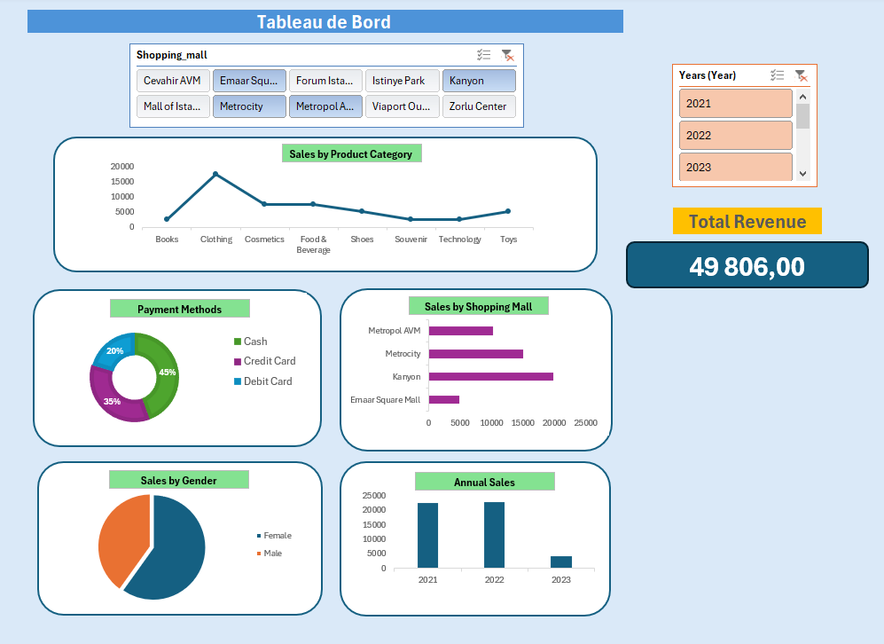

# SQL Retail Analytics Portfolio

This repository contains SQL queries and an Excel dashboard built for a **retail sales dataset** (`Portfolio_Sales.Sales_Mall`).  
It is part of my **Data Analytics portfolio**, showcasing business-oriented KPIs and insights using **Google BigQuery** and **Excel**.

---

##  SQL Analyses

The SQL scripts are in [`retail_analytics_portfolio.sql`](retail_analytics_portfolio.sql).  
Each query is fully documented with **Purpose** and **Insight**.

### Included Queries
- **a) Total Revenue (KPI)** → Overall sales performance.
- **b) Revenue by Year** → Growth trends across years.
- **c) Revenue by Shopping Mall** → Compare malls performance.
- **d) Revenue by Category and Mall** → Identify top-selling categories per mall.
- **e) Average Order Value (AOV)** → Average basket size per order.
- **f) Payment Method Mix** → Distribution of revenue by payment method.
- **g) Customer Cohorts** → Retention analysis by first purchase month.

---

##  Files in this Repository
- `retail_analytics_portfolio.sql` → SQL queries for KPIs and business insights.
- `retail_sales_dashboard.xlsx` → Excel dashboard built with interactive charts.
- `Dashboard_preview.png` → Snapshot of the Excel dashboard.

---

##  Dashboard Preview

Here is a snapshot of the Excel dashboard built for the retail dataset:

The dashboard includes:
- Revenue by year  
- Revenue by shopping mall  
- Revenue by product category  
- Average Order Value (AOV)  
- Payment method mix  
- Sales by gender  

---

##  Tech Stack
- **SQL** (Google BigQuery)  
- **Excel** (Data visualization & dashboarding)  

---

##  About
This project demonstrates my ability to:
- Write **clean and well-documented SQL queries**.  
- Extract **business insights** from raw sales data.  
- Build **interactive dashboards** in Excel for decision-making support.  

---

👤 **Author**: Selim Ben Halima  
📌 [LinkedIn](https://www.linkedin.com/in/selim-benhalima/) | [GitHub](https://github.com/SelimBenHalima-web)
